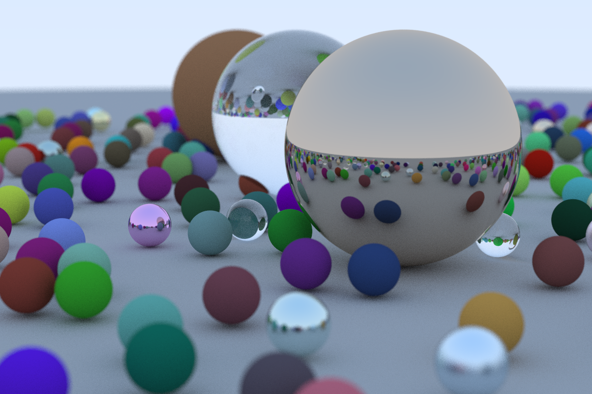

# ray-tracer-demo


This is my attempt at creating a Ray Tracer using the [Ray Tracing in a Weekend Tutorial](https://raytracing.github.io/books/RayTracingInOneWeekend.html) using Rust.

Each commit corresponds to a chapter in the book.

## Rendering
Just like in the tutorial the iamge is generated by printing and then redirecting out put to a file. To render an image run the following command:

```
cargo run > image.ppm
```

## Final Render
